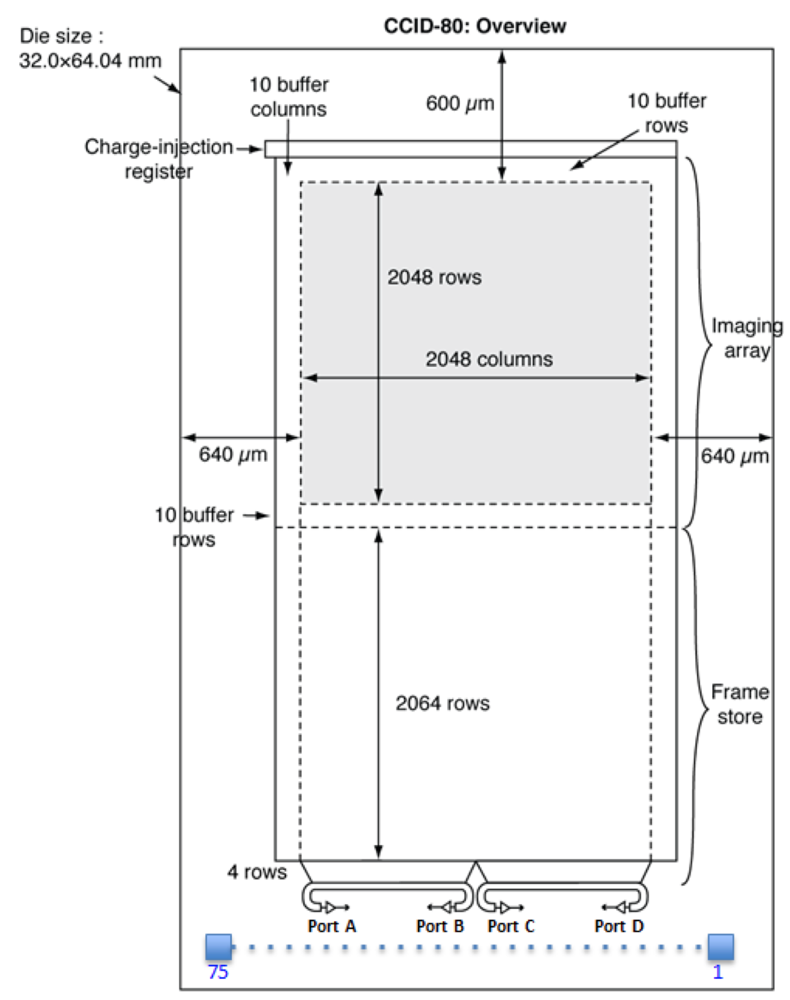
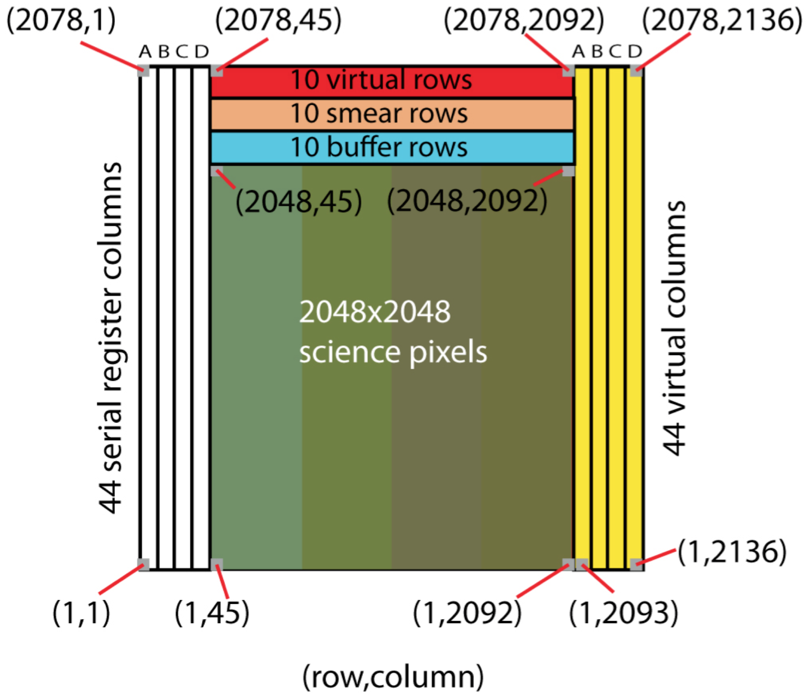

  .. _ccd-and-slice-layout:

CCD and Slice Layout
====================

Chip level
----------

Below the layout of the CCID80 silicon is shown. 

   CCID80 Layout Diagram

Note that while the *official* imaging array is 2048 by 2048, there are 
addition *buffer rows* above and below that may also be used for imaging.  
The manufacturer asserts these rows are not as well calibrated given their 
proximity to the edge of the chip. Because TESS covers some of the lower 
buffer rows are covered with  aluminum , these are not used.  The upper 
buffer rows are readout with the rest of the image and no distinction is made.

The *buffer columns* do not connect to the output ports, so they do not
appear in the data.

Not clearly shown in the CCID80 layout diagram is the 
division of the imaging array and frame store into four *slices*. 
Each slice has 512 columns. These are indexed by A through D here, and 0 through 3 throughout the code for ``httm``.

There are 11 *pre-scan pixels* in the serial register between
the bottom corner of the slice and its corresponding output port.

Note that output ports A and C are on the left edges of their slices
while B and D are on the right edges of their slices. A consequence of
this is that the electronics read pixels from rows in the A and C slices
left to right, but those in the B and D slices right to left (in all
cases, the electronics read rows from bottom to top in these diagrams).

Slice Level
-----------

Slice level refers to the data taken from a specific port through a measurement chain to its associated *Analogue To Digital Converter* (ADC).

It is important to understand how slice level functions electrically for
simulation and calibration.

Each slice has its own measurement chain and ADC. 

The slice diagram below depicts the format of the data output by the ADC.

.. figure:: figures/Slice.jpg
   :alt: Slice Diagram

   Slice Diagram

The *lower buffer rows* from the CCID80 layout digram are 
not included in the raster.  Their charge is 
cleared prior to readout of the individual pixels.  
This is because some of these rows are covered with
silicon and not exposed to significant amounts of light.

The upper buffer rows from the CCID80 layout diagram are included and
no special distinction is made between them and the other image pixels.

The area labeled *smear pixels* in the slice layout
are only exposed to light during the frame transfer time.
They measure the excess charge in a column due to the unwanted exposure during frame transfer.

The dark pixels are never exposed to light, and are used to measure
video bias.

Raw FITS Representation of Full Frames
--------------------------------------

   Raw FITS Layout Diagram

In the Raw FITS layout diagram, the following columns refer to each of the four slices:

-  Slice A: 1..11, 45..556, 2093..2103
-  Slice B: 12..22, 1068..557, 2104..2114
-  Slice C: 23..33, 1069..1580, 2115..2125
-  Slice D: 34..44, 2092..1581, 2126..2136

Remember that in ``httm`` Slice A is indexed as Slice 0, Slice B is indexed as Slice 1, C as 2, and D as 3.

