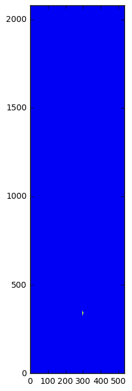
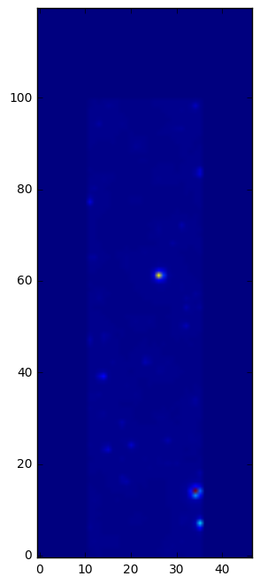

Tutorial
========

This tutorial demonstrates basic usage of ``httm``.

Getting Started
---------------

Importing ``matplotlib``
~~~~~~~~~~~~~~~~~~~~~~~~

To start, we will import ``matplotlib`` and increase the figure size so
we can reasonably see artifacts in various FITS images we are going to
be looking at.

.. code:: ipython3

    %matplotlib inline
    %config InlineBackend.figure_format = 'png'

.. code:: ipython3

    import matplotlib
    matplotlib.rcParams['figure.figsize'] = (8, 8)

Viewing a RAW FITS File
~~~~~~~~~~~~~~~~~~~~~~~

Assume you have a file:

::

    fits_data/raw_fits/single_ccd.fits

...containing an unmodified FITS full frame image.

To get started, open this file and extract a
``httm.data_structures.raw_converter.SingleCCDRawConverter`` object.

This is done by calling
``httm.fits_utilities.raw_fits.raw_converter_from_fits``.

.. code:: ipython3

    import httm

.. code:: ipython3

    from httm.fits_utilities.raw_fits import raw_converter_from_fits
    
    raw_data = raw_converter_from_fits('fits_data/raw_fits/single_ccd.fits')

Each raw image contains the data for a single CCD. It contains 4 slices
if it was taken by the instrument, and either 1 or 4 if it was created
synthetically.

Below, we visualize the first slice of the image.

.. code:: ipython3

    matplotlib.pyplot.imshow(raw_data.slices[0].pixels)
    matplotlib.pyplot.gca().invert_yaxis()

Viewing an Electron Flux FITS Image
~~~~~~~~~~~~~~~~~~~~~~~~~~~~~~~~~~~

.. code:: ipython3

    from httm.fits_utilities.electron_flux_fits import electron_flux_converter_from_fits
    
    electron_flux_data = electron_flux_converter_from_fits('fits_data/electron_flux_fits/small_simulated_data.fits')

.. code:: ipython3

    matplotlib.pyplot.imshow(electron_flux_data.slices[0].pixels)
    matplotlib.pyplot.gca().invert_yaxis()

