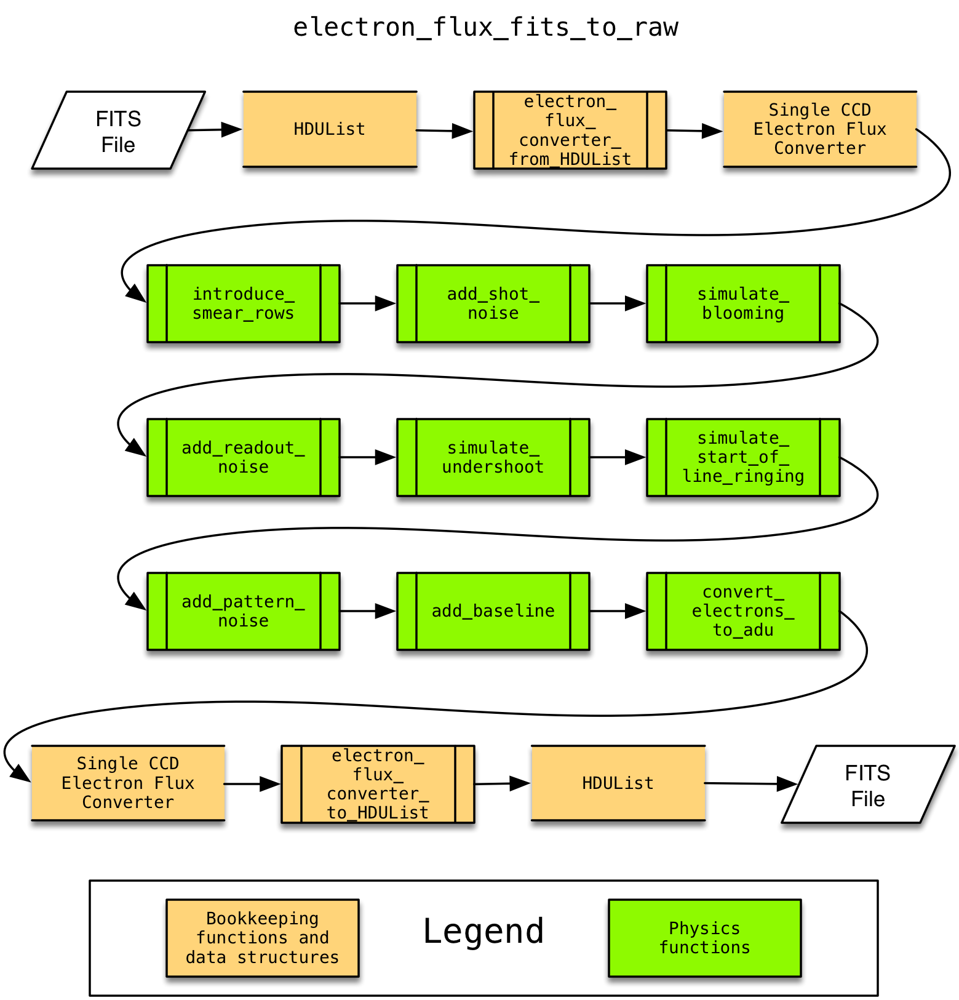

Software Architecture
=====================

This section describes the over-all software architecture.

Converting an Electron Flux FITS Image to a Raw FITS Image
----------------------------------------------------------

The transformation from an electron flux FITS to a simulated raw image is implemented
in the :py:func:`~httm.electron_flux_fits_to_raw` function, see that function's documentation for details.

Converting a Raw FITS Image to a Calibrated FITS Image
------------------------------------------------------

The transformation from raw FITS to calibrated is implemented in the :py:func:`~httm.raw_fits_to_calibrated` function,
see that function's documentation for details.

.. image:: figures/raw_fits_to_calibrated.png
