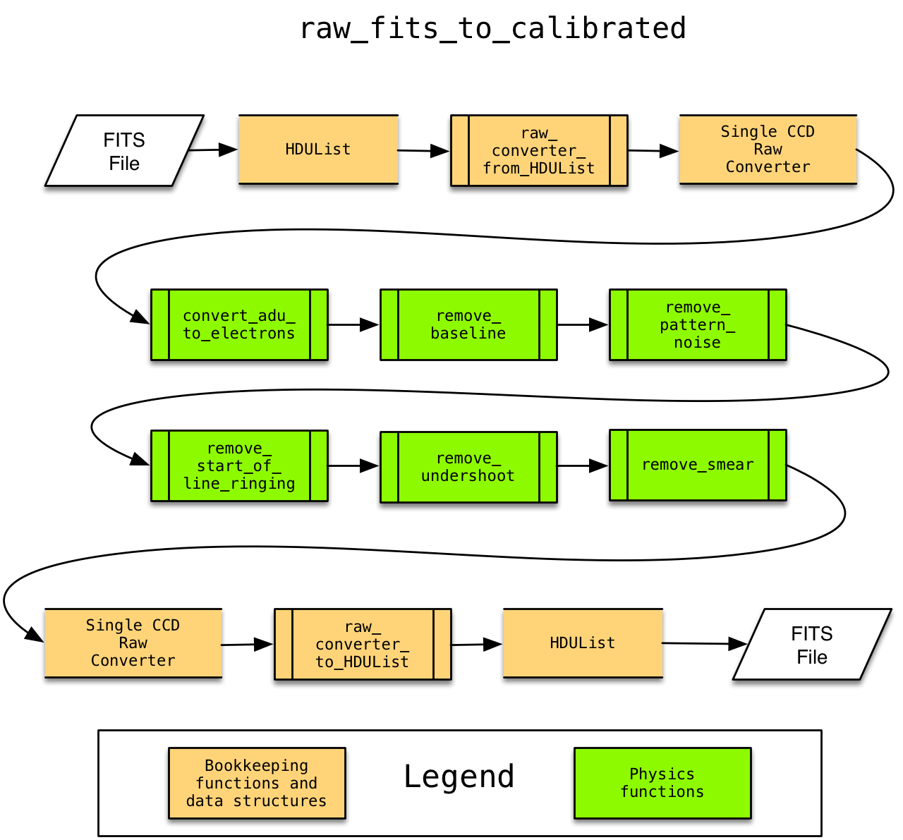

Software Architecture
=====================

This section describes the over-all software architecture.

Converting a Calibrated FITS Image to a Raw FITS Image
------------------------------------------------------

The transformation from calibrated FITS to raw is implemented in the :py:func:`~httm.calibrated_fits_to_raw` function,
see that function's documentation for details.

.. image:: figures/calibrated_fits_to_raw.png

Converting a Raw FITS Image to a Calibrated FITS Image
------------------------------------------------------

The transformation from raw FITS to calibrated is implemented in the :py:func:`~httm.raw_fits_to_calibrated` function,
see that function's documentation for details.

